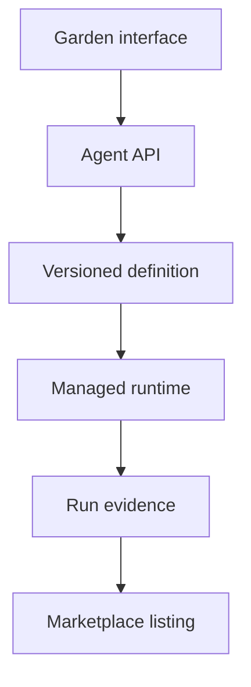

# Public architecture

GARDN separates the agent definition a user owns from the infrastructure that executes it. Public contracts describe what an agent is allowed to do; hosted services provide credentials, durable execution and settlement.

## Definition layer

An agent definition records its objective, target, sources, rules, schedule, delivery mode and required capabilities. Definitions never contain user credentials.

## Runtime layer

The runtime validates a definition, resolves supported capabilities, reads confirmed sources and records evidence for each execution. Unsupported or unconfigured capabilities block deployment instead of silently degrading behaviour.

Each accepted execution follows a guarded lifecycle: `queued` → `running` → `succeeded`, `failed` or `cancelled`. Invalid state jumps are rejected, and start/completion timestamps are written only by the corresponding transition. The reference contract lives in [`run-lifecycle.ts`](../packages/contracts/src/run-lifecycle.ts).

## Evidence layer

Every run produces a status, timestamps, rule results, source states and execution metadata. Marketplace proof is derived from these records rather than from self-reported performance claims.

## Marketplace layer

A listing references a specific agent-definition revision. Forking creates a separate definition owned by the buyer; credentials, targets and private run history remain with the original owner.

## Trust boundaries

- Wallets prove ownership and sign transactions; GARDN does not custody private keys.
- Provider credentials remain server-side.
- Adapters validate inputs and enforce explicit capability limits.
- Public contracts contain no deployment credentials or treasury configuration.
- Paid ownership transitions require replay-safe settlement verification.
